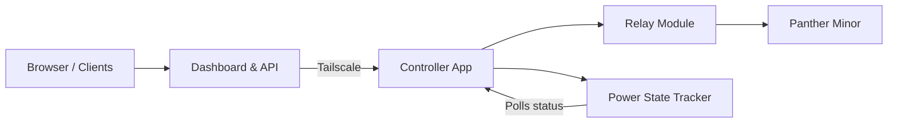

<div align="center">

# 🖲️ Panther Minor Controller

### Remote control for [Panther Minor](https://github.com/rozsival/panther-minor) AI workstation


Light-weight secure remote control for Panther Minor in a single binary that runs on a
**Raspberry Pi Zero 2 W**. It provides a web interface and API to **power up**, **power down**, **force shutdown**, and
**hard reset** the workstation remotely, with real-time status tracking and confirmation.

</div>

---

## ✨ Features

| Feature                  | What it gives you                                                                         |
| ------------------------ | ----------------------------------------------------------------------------------------- |
| **Web dashboard**        | Clean, responsive interface with real-time status, action buttons, and confirmation flow  |
| **REST API**             | Full programmatic control — integrate with scripts, automation, or other tools            |
| **Status tracking**      | Internal power-state tracking with `/api/health` and `/api/status` endpoints              |
| **Action confirmation**  | Dashboard polls status after each action to confirm the device reached the expected state |
| **Secure remote access** | Tailscale-only access, hardened SSH, firewall, and fail2ban                               |
| **Zero-touch install**   | One script to prepare the Raspberry Pi, another to install and daemonize the controller   |

---

## 🏗️ Architecture



The Controller runs on a **Raspberry Pi Zero 2 W** wired to a **5V relay module** that bridges the Panther Minor's power button pins (PWR+ ↔ PWR-). A short relay closure simulates a button press — **0.5s for power on/off**, **5s for force shutdown**. Communication between your browser and the Pi happens exclusively over **Tailscale**.

---

## 🧰 Prerequisites

### Hardware

| Component    | Recommendation                     |
| ------------ | ---------------------------------- |
| Board        | **Raspberry Pi Zero 2 W**          |
| Power supply | Official Pi Zero USB PSU           |
| MicroSD card | 16 GB or more, Class 10 or U1      |
| Relay module | 5V single-channel with octocoupler |
| Wiring       | Jumper wires (female-to-female)    |

### Wiring

Connect the relay module to the Raspberry Pi GPIO as follows:

| Relay Pin | Pi Pin (BCM)       | Purpose                            |
| --------- | ------------------ | ---------------------------------- |
| VCC       | 5V (Pin 2)         | Power                              |
| GND       | GND (Pin 6)        | Ground                             |
| IN1       | BCM 17 (Pin 11)    | Signal (configurable via env)      |
| NC        | —                  | Not used                           |
| COM       | Panther Minor PWR+ | Connects to power button           |
| NO        | Panther Minor PWR- | Bridges PWR pins when relay closes |

> [!NOTE]
> The relay is **active-low**: setting the GPIO pin LOW closes the relay (shorts the PWR pins). The default GPIO pin
> is **BCM 17**. Change it via the `GPIO_PIN` environment variable.

### Software

- 🍇 [Raspberry Pi OS Lite](https://www.raspberrypi.com/software/operating-systems/) (64-bit, minimal image)
- SD card flashed via [Raspberry Pi Imager](https://www.raspberrypi.com/software/)
- SSH enabled with key auth during flashing
- Wi-Fi configured during flashing
- A [Tailscale](https://tailscale.com/) account for secure remote access

---

## 🚀 Quick Start

### 1. Set up the Raspberry Pi

SSH into your Raspberry Pi and run the device setup script:

> [!WARNING]
> SSH will be available on **port 2222** with **key-based authentication only**.
>
> Reconnect with: `ssh -p 2222 <user>@<pizero-ip>`

```bash
wget https://raw.githubusercontent.com/rozsival/panther-minor-controller/refs/heads/main/scripts/setup-device.sh -O setup-device.sh
sudo bash setup-device.sh
rm setup-device.sh
```

> [!NOTE]
> The script is interactive — it will prompt for server name, allowed user, SSH port, and timezone.
> Default values are suggested for each. If you prefer non-interactive mode, set environment variables:
> `sudo PANTHER_SERVER_NAME=myhost PANTHER_ALLOWED_USER=pi bash setup-device.sh`

> [!NOTE]
> The script prompts for confirmation before overwriting. It requires an existing installation — use `install-app.sh` for a fresh install.

### 2. Connect Tailscale

After the initial setup authenticate the server to your
[Tailscale network](https://login.tailscale.com/admin/):

```bash
sudo tailscale up
```

Follow the browser link to authenticate. Once connected, access your Raspberry through its Tailscale hostname (e.g. `pi-zero`).

> [!TIP]
> It is usually best to
> [disable key expiry](https://login.tailscale.com/admin/machines)
> for the Pi in Tailscale to avoid losing access.

### 3. Install the controller

After the device setup completes, install the controller binary as a `systemd` service:

```bash
wget https://raw.githubusercontent.com/rozsival/panther-minor-controller/refs/heads/main/scripts/install-app.sh -O install-app.sh
sudo bash install-app.sh
rm install-app.sh
```

> [!TIP]
> Customize GPIO_PIN and PORT in `/opt/panther-minor-controller/env` as needed.

#### Update the controller

To update to a newer release, run the update script (it stops the service, replaces the binary, then restarts):

```bash
wget https://raw.githubusercontent.com/rozsival/panther-minor-controller/refs/heads/main/scripts/update-app.sh -O update-app.sh
sudo bash update-app.sh
rm update-app.sh
```

4. Access the dashboard

Open your browser and navigate to `http://pi-zero:8080` (replace with your Pi's Tailscale hostname and port if customized). You should see the dashboard with action buttons and real-time status.

---

## ⚙️ What the setup scripts configure

### `setup-device.sh`

Prepares the Raspberry Pi with:

- **Timezone** — sets the system timezone
- **Essential packages** — core packages with unattended upgrades enabled
- **SSH hardening** — custom port, key-only auth, disabled root login, restricted users
- **UFW** — firewall with only allowed SSH port open
- **GPIO group** — grants the allowed user access to GPIO pins
- **fail2ban** — brute-force protection
- **Tailscale** — Tailscale agent installation
- **Shell** — modern shell prompt for the current user

### `install-app.sh`

Installs the controller as a managed service:

- Downloads the latest binary from GitHub Releases
- Creates an environment file at `/opt/panther-minor-controller/env`
- Installs a `systemd` service (`panther-minor-controller.service`) that starts after Tailscale
- Enables auto-restart on failure

### `update-app.sh`

Updates the controller binary without reconfiguring the service:

- Downloads the latest binary from GitHub Releases
- Prompts for confirmation before overwriting the existing binary
- Stops the service, replaces the binary, then restarts it
- Exits with a helpful message if no existing binary is found (suggests `install-app.sh`)

---

## 🖥️ Dashboard

The web dashboard provides a clean interface with four action buttons:

| Button        | Action                | Relay Behavior              |
| ------------- | --------------------- | --------------------------- |
| 🟢 Power On   | Start the workstation | Short press 0.5s            |
| 💤 Power Off  | Graceful shutdown     | Short press 0.5s (ACPI)     |
| 🔴 Shutdown   | Force shutdown        | Long press 5s               |
| 🔄 Hard Reset | Power cycle           | 5s off → 2s pause → 0.5s on |

The dashboard tracks real-time status, disables buttons when actions are in progress, and polls the device state after
each action to confirm it reached the expected state.

---

## 🔧 Service management

```bash
# Check status
systemctl status panther-minor-controller

# View logs
journalctl -u panther-minor-controller -f

# Restart
sudo systemctl restart panther-minor-controller

# Stop
sudo systemctl stop panther-minor-controller

# Enable on boot (default)
sudo systemctl enable panther-minor-controller
```

### Environment variables

Env vars are set in `/opt/panther-minor-controller/env` and loaded by the `systemd` service.

| Variable         | Description                | Default |
| ---------------- | -------------------------- | ------- |
| `GPIO_PIN`       | BCM GPIO pin for the relay | `17`    |
| `PORT`           | HTTP server port           | `8080`  |
| `STATUS_POLL_MS` | Status polling interval    | `2000`  |

---

## 🛡️ Security

The controller is designed with a defense-in-depth approach:

- **Tailscale only** — the server binds to `0.0.0.0` but is only reachable through your Tailscale network
- **Hardened SSH** — custom port, key-only authentication, no root login
- **UFW firewall** — only SSH port is open; all other inbound traffic is denied
- **fail2ban** — protects against SSH brute-force attempts

---

## 📚 More documentation

- [API Reference](API.md) — details of the REST API endpoints and expected responses
- [WOL Setup](WOL.md) — how to set up Wake-on-LAN for remote wake/sleep control (advanced)
- [Panther Minor](https://github.com/rozsival/panther-minor) — the AI workstation this controller manages
