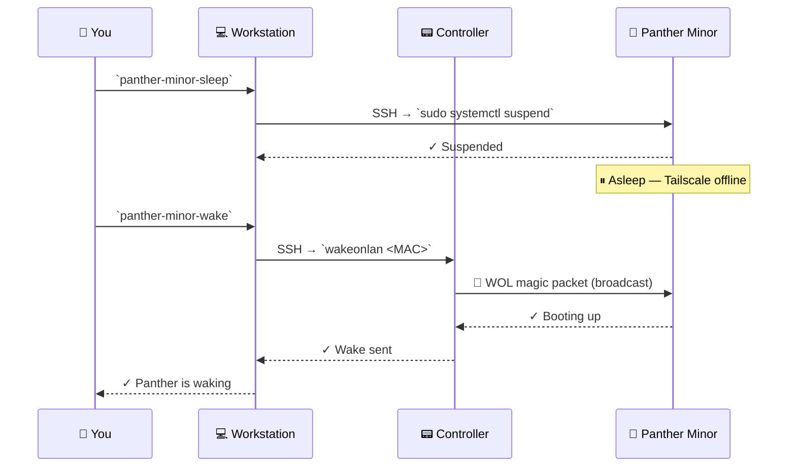

# 😴 Panther Minor — Sleep & Wake on LAN

This guide walks you through setting up **Sleep Mode** and **Wake on LAN (WOL)** for your Panther Minor workstation. With this setup, you can remotely put your Panther to sleep and wake it from anywhere — saving power when it's idle.

> [!IMPORTANT]
> **Panther Minor and the Controller must be on the same LAN.** WOL packets are broadcast and cannot traverse routers or the internet.

---

## 🐆 Panther Minor Setup

### 1. Enable WOL in BIOS

Boot the Panther into BIOS/UEFI and enable one of the following (wording varies by motherboard):

- **Wake on LAN**
- **Power on by PCI-E**

### 2. Configure WOL in the OS

Ensure your network adapter supports WOL and enable it. Replace `<interface>` with your actual adapter name (e.g., `eth0`, `enp1s0`):

```bash
# Check if WOL is supported
sudo ethtool <interface> | grep "Supports Wake-on"

# Enable WOL (g = magic packet + link up + wake-up)
sudo ethtool -s <interface> wol g
```

### 3. Test the Setup

Put the Panther to sleep and try waking it from the Controller:

```bash
# On Panther — put it to sleep
sudo systemctl suspend

# On Controller — send a WOL magic packet
wakeonlan <PANTHER_MAC_ADDRESS>
```

> [!NOTE]
> The Controller needs the `wakeonlan` utility installed. Install it with your package manager if it isn't already available.

### 4. Make WOL Persistent Across Reboots

`ethtool` settings don't survive a reboot. Create a systemd service so WOL is re-enabled every boot:

```bash
sudo tee /etc/systemd/system/wol.service > /dev/null <<EOF
[Unit]
Description=Enable Wake on LAN
After=network.target

[Service]
Type=oneshot
ExecStart=/usr/sbin/ethtool -s <interface> wol g

[Install]
WantedBy=multi-user.target
EOF

sudo systemctl enable wol.service
```

### 5. Allow Remote Suspend Without a Password

When you trigger suspend over SSH, `systemctl` will prompt for a password. Disable that prompt for the suspend command:

```bash
sudo visudo
```

Add this line (replace `<user>` with your Panther Minor username):

```text
<user> ALL=(ALL) NOPASSWD: /bin/systemctl suspend
```

---

## 🛰️ Remote Control Aliases

Set up these aliases on your **workstation** for one-command sleep and wake:

```bash
# Suspend the Panther remotely
alias panther-minor-sleep='ssh -f -p <port> <user>@<panther-hostname> "sudo systemctl suspend"'

# Wake the Panther via the Controller
alias panther-minor-wake='ssh -f -p <port> <user>@<controller-hostname> "wakeonlan <PANTHER_MAC_ADDRESS>"'
```

Add them to your shell profile (`~/.bashrc`, `~/.zshrc`, etc.) to persist across sessions.

---

## ❓ How This Works

Under normal circumstances, you could send a Wake-on-LAN magic packet directly to your Panther on the local network. But when you're remote, that won't work — Panther is only reachable through **Tailscale**, and the Tailscale daemon stops running once the machine sleeps.

**The solution:** use the Controller as a bridge. It stays powered on and connected to the LAN at all times, so it can broadcast the WOL magic packet on your behalf. This lets you wake Panther from anywhere in the world, even when you're on a completely different network.




**Sleep** — you tell the workstation to SSH into Panther and suspend it. Panther goes to sleep and Tailscale stops running.

**Wake** — you tell the workstation to SSH into the Controller, which broadcasts a WOL magic packet on the LAN. Panther wakes up and Tailscale comes back online.
