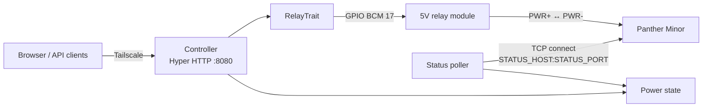
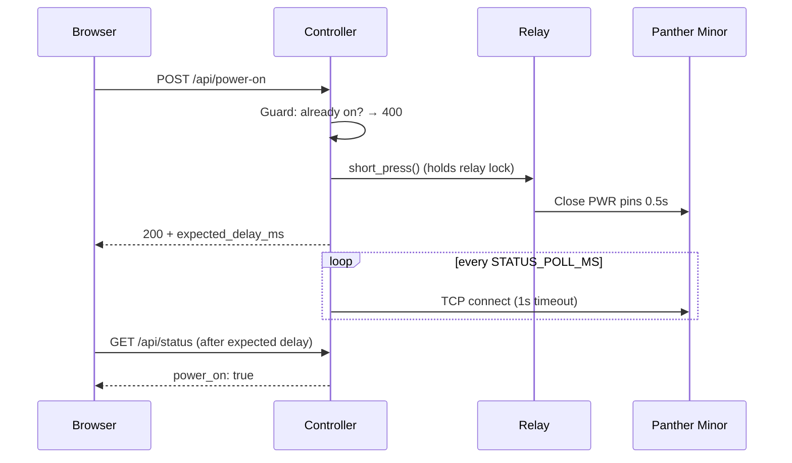

# 🏗️ Architecture

> Panther Minor Controller is a single Rust binary on a Raspberry Pi Zero 2 W. It serves a dashboard and a JSON API
> over Tailscale, drives a relay wired across the Panther Minor's power button pins, and tracks the workstation's
> power state through a TCP reachability probe.

**Related:** [Hardware & wiring](hardware.md) · [API reference](api.md) · [Networking & security](networking.md) ·
[Development](development.md)

---

## 🗺️ System map

A short relay closure is a power button press. The controller never talks to the workstation's OS — it only presses
the button and checks whether a TCP port answers.

## 🧩 Components

| Component         | Location                         | Role                                                                             |
| ----------------- | -------------------------------- | -------------------------------------------------------------------------------- |
| HTTP server       | `src/main.rs`                    | Hyper 1.x HTTP/1 server on `0.0.0.0:<PORT>`; routes dashboard and API requests   |
| Request handler   | `src/main.rs` (`handle_request`) | Applies state guards, triggers the relay, builds JSON responses                  |
| Status poller     | `src/main.rs` (`status_poller`)  | Background task probing `STATUS_HOST:STATUS_PORT` every `STATUS_POLL_MS`         |
| Relay abstraction | `src/gpio.rs` (`RelayTrait`)     | Async trait with `short_press`, `graceful_power_off`, `long_press`, `hard_reset` |
| Dashboard         | `src/html.rs`                    | Self-contained HTML + JS page, version injected at build time                    |
| Errors            | `src/error.rs`                   | `AppError` (`GpioSetup`, `Http`, `Io`) and the `Result<T>` alias                 |

### Relay implementations

| Target         | Type        | Behavior                                                                                              |
| -------------- | ----------- | ----------------------------------------------------------------------------------------------------- |
| Linux          | `Relay`     | Drives the GPIO pin through [`rppal`](https://github.com/golemparts/rppal); pin HIGH closes the relay |
| macOS / others | `Relay`     | Simulation mode: prints `[SIM]` lines and sleeps for the real press durations                         |
| Tests          | `MockRelay` | Counts calls in a shared `HashMap`; no GPIO, no sleeps                                                |

### Press timings

| Action     | Relay sequence                  | Effect on the workstation             |
| ---------- | ------------------------------- | ------------------------------------- |
| Power on   | Close 0.5s                      | Boots the machine                     |
| Power off  | Close 0.5s                      | ACPI power button event → OS shutdown |
| Shutdown   | Close 5s                        | Firmware forced power-off             |
| Hard reset | Close 5s → open 2s → close 0.5s | Forced power-off, then boot           |

## 🔀 Request flow

1. Every action checks the current power state first and returns `400` when the device is already in the target
   state — see [API reference](api.md#-state-guards).
2. The relay sits behind a `tokio::sync::Mutex`, so presses are serialized and the HTTP response is sent only after
   the press sequence finishes.
3. The response carries `expected_delay_ms` and `confirmation_poll_ms`; the [dashboard](dashboard.md) uses them to
   wait for the probe to confirm the new state.

## 🔦 Power state tracking

The controller keeps a single `power_on: Arc<RwLock<bool>>` in `AppState`, initialized to `false` on startup. How it
changes depends on whether the status probe is configured:

| Mode                    | Configured by                 | `power_on` source                                                   |
| ----------------------- | ----------------------------- | ------------------------------------------------------------------- |
| **Probe** (recommended) | `STATUS_HOST` + `STATUS_PORT` | TCP connect to the target succeeds within 1s → `true`, else `false` |
| **Optimistic**          | Neither variable set          | Flipped by the controller's own actions; never observes the device  |

In probe mode, actions do **not** change `power_on` — only the poller does, so out-of-band changes (pressing the
physical button, an OS-initiated shutdown) show up within one poll interval. Configuration details live in
[Operations](operations.md#-status-probe).

## 📁 Repository layout

| Path                 | Contents                                                                             |
| -------------------- | ------------------------------------------------------------------------------------ |
| `src/`               | Application source (`main.rs`, `gpio.rs`, `html.rs`, `error.rs`)                     |
| `scripts/`           | `setup-device.sh`, `install-app.sh`, `update-app.sh` — published with each release   |
| `docs/`              | This documentation                                                                   |
| `.github/workflows/` | CI (`ci.yml`) and release (`release.yml`) pipelines                                  |
| `.agents/skills/`    | Agent skills for recurring maintenance ([Development](development.md#-agent-assets)) |
| `Cargo.toml`         | Crate manifest, pinned dependencies, size-optimized release profile                  |
| `package.json`       | Node.js tooling: Prettier, commitlint, Lefthook                                      |

---

## ❓ FAQ

### Why a relay instead of software shutdown over SSH?

A relay works when the workstation is off, hung, or has no network — exactly the situations where remote access is
needed. It also needs no credentials or agent on the workstation.

### Why does the state start as "off" after the controller restarts?

`power_on` is initialized to `false`. In probe mode the first poll corrects it within `STATUS_POLL_MS`; in optimistic
mode it stays wrong until an action flips it. Configure the [status probe](operations.md#-status-probe).

### What happens if two clients press buttons at the same time?

The relay mutex serializes the presses, but the state guard is checked **before** waiting for the relay lock. A second
request that arrives while the first press is still running can pass the guard and press again once the first one
finishes. The dashboard disables all buttons during an action, so this only affects multiple tabs or API clients.

### Can I run the controller on a laptop for development?

Yes. On non-Linux targets the relay runs in simulation mode — see [Development](development.md#-running-locally).
