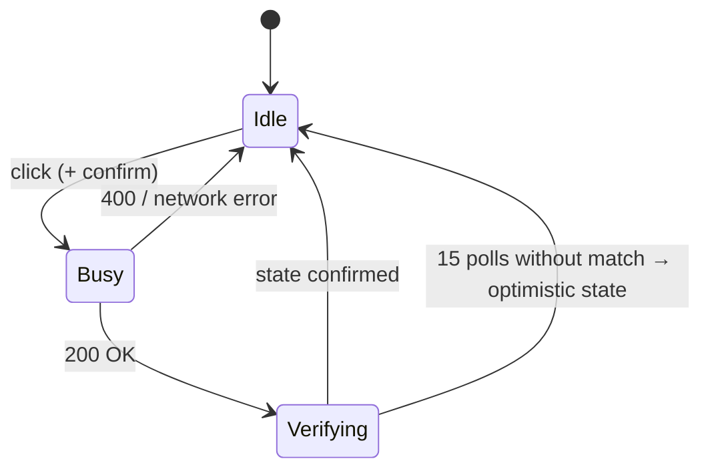

# 🖥️ Dashboard

> The web page served at `/`: a live power status indicator, four action buttons that enable only when they make
> sense, confirmation dialogs for destructive actions, and automatic verification after every press.

**Related:** [API reference](api.md) · [Operations](operations.md#-status-probe) ·
[Architecture](architecture.md#-power-state-tracking)

---

## 🔘 Controls

| Button        | Endpoint         | Relay behavior              | Enabled when | Confirmation dialog |
| ------------- | ---------------- | --------------------------- | ------------ | ------------------- |
| 🟢 Power On   | `/api/power-on`  | Short press 0.5s            | Off          | —                   |
| 💤 Power Off  | `/api/power-off` | Short press 0.5s (ACPI)     | On           | ✅                  |
| 🔴 Shutdown   | `/api/shutdown`  | Long press 5s               | On           | ✅                  |
| 🔄 Hard Reset | `/api/reset`     | 5s off → 2s pause → 0.5s on | On           | ✅                  |

## 🚦 Status indicator

| Indicator      | Meaning                                                                   |
| -------------- | ------------------------------------------------------------------------- |
| **Online**     | `/api/status` reports `power_on: true`                                    |
| **Offline**    | `/api/status` reports `power_on: false`, or the controller is unreachable |
| **Busy**       | A press is being sent to the relay                                        |
| **Verifying…** | Waiting for the status probe to confirm the expected state                |

On load the page reads `/api/health` for the initial state and `poll_ms`, then refreshes `/api/status` every
`poll_ms` milliseconds. Changes made outside the dashboard — the physical button, an OS shutdown, another client —
appear automatically.

## 🔁 Action lifecycle

1. **Busy** — all buttons are disabled while the request runs (up to 7.5s for a hard reset).
2. **Verifying** — the page waits `expected_delay_ms` from the response, then polls `/api/status` every
   `confirmation_poll_ms`, up to **15 times**.
3. **Confirmed** — the status matches and buttons are re-enabled for the new state.
4. **Not confirmed** — the page shows _"Device state not confirmed — showing optimistic state"_ and assumes the
   action succeeded. Background polling corrects it on the next refresh if the probe disagrees.

| Action     | Initial wait | Worst case until a verdict |
| ---------- | -----------: | -------------------------: |
| Power on   |          60s |                       135s |
| Power off  |          30s |                       105s |
| Shutdown   |          15s |                        90s |
| Hard reset |          75s |                       150s |

---

## ❓ FAQ

### Why are some buttons greyed out?

Buttons follow the [state guards](api.md#-state-guards): Power On only when off, the other three only when on.
They are also all disabled while an action is running or being verified.

### Why does Power On not ask for confirmation?

It cannot harm a powered-off machine. The other three interrupt a running system and ask first.

### The page shows "Network error". What now?

The browser cannot reach the controller. Check that your device is on the tailnet and the service is running — see
[Service management](operations.md#-service-management).

### Can I put the dashboard on my phone's home screen?

Yes. It is a single responsive page with no external assets; open it through Tailscale on the phone and add it to the
home screen.
