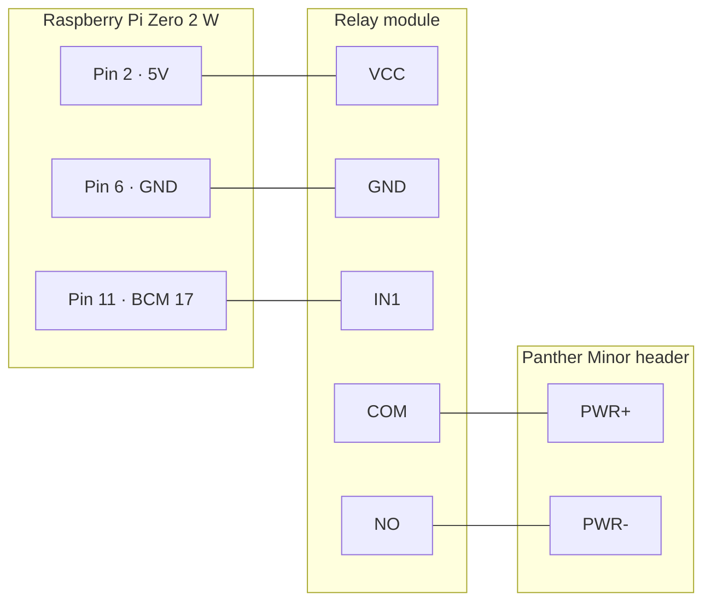

# 🔌 Hardware & Wiring

> The bill of materials and the wiring between the Raspberry Pi Zero 2 W, a 5V relay module and the Panther Minor's
> front-panel power button header. The relay is wired in parallel with the physical button, which keeps working.

**Related:** [Installation](installation.md) · [Architecture](architecture.md) · [Operations](operations.md#-configuration)

---

## 🧰 Bill of materials

| Component    | Recommendation                                |
| ------------ | --------------------------------------------- |
| Board        | **Raspberry Pi Zero 2 W**                     |
| Power supply | Official Raspberry Pi Zero USB power supply   |
| MicroSD card | 16 GB or more, Class 10 or U1                 |
| Relay module | 5V **single-channel** module with optocoupler |
| Wiring       | Female-to-female jumper wires                 |

> [!TIP]
> Power the Pi from an always-on source (a wall socket, not the workstation's USB ports) so the controller stays up
> while the Panther Minor is off.

## 🔗 Wiring

| Relay pin | Connects to            | Purpose                                  |
| --------- | ---------------------- | ---------------------------------------- |
| `VCC`     | Pi **5V** (pin 2)      | Relay coil power                         |
| `GND`     | Pi **GND** (pin 6)     | Ground                                   |
| `IN1`     | Pi **BCM 17** (pin 11) | Control signal (configurable)            |
| `COM`     | Panther Minor `PWR+`   | Power button header                      |
| `NO`      | Panther Minor `PWR-`   | Bridges the header when the relay closes |
| `NC`      | —                      | Not used                                 |

> [!NOTE]
> The controller treats the relay as **active-high**: driving the GPIO pin HIGH closes the relay and shorts the
> power button pins. The pin is initialized LOW on startup and is left untouched when the process exits.

## 📍 GPIO pin

The default signal pin is **BCM 17** (physical pin 11). To use another pin, set `GPIO_PIN` to its **BCM** number in
the controller's environment file and restart the service — see [Operations](operations.md#-configuration).

> [!WARNING]
> `GPIO_PIN` uses BCM numbering, not physical pin numbers. `GPIO_PIN=11` drives BCM 11 (physical pin 23).

## ⏱️ What a "press" means

| Press      | Relay closed for            | Typical motherboard reaction          |
| ---------- | --------------------------- | ------------------------------------- |
| Short      | 0.5s                        | Power on, or ACPI shutdown when on    |
| Long       | 5s                          | Forced power-off                      |
| Hard reset | 5s, then 2s open, then 0.5s | Forced power-off followed by power on |

---

## ❓ FAQ

### Does the physical power button still work?

Yes. The relay is wired in parallel with the button on the same header, so either can close the circuit.

### My relay module triggers when the pin is LOW. Can I use it?

Not without changes. The controller drives the pin HIGH to press, so an active-low (low-level trigger) module would
hold the button down while idle. Use a high-level trigger module or one with a jumper set to high-level trigger.

### Can I power the relay from 3.3V?

No — wire `VCC` to 5V as shown above; the module is a 5V part. Only the `IN1` signal is 3.3V, because that is what
the Pi's GPIO outputs, so pick a module whose input is specified to trigger from 3.3V logic.

### Which pins are `PWR+` and `PWR-` on my motherboard?

They are the `PWRBTN` / `PWR_SW` pins of the front-panel header; check the motherboard manual. The hardware
recommendation for the workstation itself lives in [Panther Minor](https://github.com/rozsival/panther-minor).
