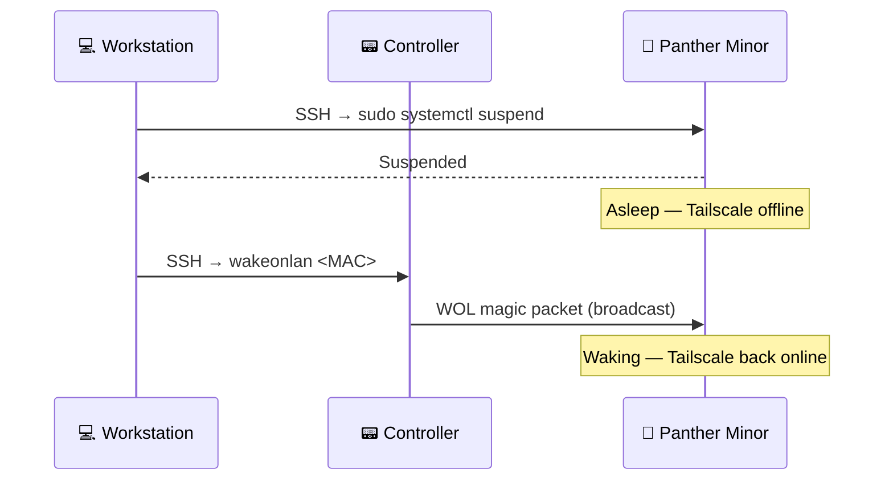

# 😴 Sleep & Wake-on-LAN

> An optional, advanced setup that suspends the Panther Minor instead of powering it off and wakes it with a
> Wake-on-LAN (WOL) magic packet broadcast by the controller. It saves power while idle and resumes faster than a
> cold boot.

**Related:** [Networking & security](networking.md) · [Installation](installation.md) ·
[Panther Minor](https://github.com/rozsival/panther-minor)

---

## 🧠 How it works

A WOL magic packet is a LAN broadcast — it cannot traverse routers or the internet. Remotely, the Panther Minor is
reachable only through Tailscale, and Tailscale stops once the machine sleeps. The controller bridges the gap: it is
always on and always on the LAN, so it broadcasts the packet on your behalf.




> [!IMPORTANT]
> The Panther Minor and the controller **must be on the same LAN** (same broadcast domain).

## 🐆 Panther Minor setup

### 1. Enable WOL in BIOS

In BIOS/UEFI, enable **Wake on LAN** or **Power on by PCI-E** (wording varies by motherboard).

### 2. Enable WOL on the network adapter

Replace `<interface>` with the adapter name (e.g. `eth0`, `enp1s0`):

```bash
# Check support — look for "g" in "Supports Wake-on"
sudo ethtool <interface> | grep "Supports Wake-on"

# Enable magic packet wake-up
sudo ethtool -s <interface> wol g
```

### 3. Persist WOL across reboots

`ethtool` settings are lost on reboot. Re-apply them with a oneshot `systemd` unit:

```bash
sudo tee /etc/systemd/system/wol.service > /dev/null <<EOF
[Unit]
Description=Enable Wake on LAN
After=network.target

[Service]
Type=oneshot
ExecStart=/usr/sbin/ethtool -s <interface> wol g

[Install]
WantedBy=multi-user.target
EOF

sudo systemctl enable wol.service
```

### 4. Allow suspend without a password

So that a remote `sudo systemctl suspend` does not prompt, run `sudo visudo` and add (replace `<user>`):

```text
<user> ALL=(ALL) NOPASSWD: /bin/systemctl suspend
```

## 📟 Controller setup

Install the `wakeonlan` utility on the Pi — `setup-device.sh` does not include it:

```bash
sudo apt install -y wakeonlan
```

## ✅ Test it

```bash
# On the Panther Minor
sudo systemctl suspend

# On the controller
wakeonlan <PANTHER_MAC_ADDRESS>
```

## 🛰️ Remote aliases

Add to your workstation's shell profile (`~/.bashrc`, `~/.zshrc`, …):

```bash
# Suspend the Panther Minor
alias panther-minor-sleep='ssh -f -p <port> <user>@<panther-hostname> "sudo systemctl suspend"'

# Wake the Panther Minor through the controller
alias panther-minor-wake='ssh -f -p <port> <user>@<controller-hostname> "wakeonlan <PANTHER_MAC_ADDRESS>"'
```

---

## ❓ FAQ

### Why not use the dashboard's Power On button to wake it?

You can try, but a short power button press while suspended depends on the motherboard and OS configuration. WOL is
the predictable wake path, and suspend preserves the running session.

### What does the dashboard show while the Panther Minor sleeps?

**Offline** — a suspended machine does not answer the status probe. That also means Power Off, Shutdown and Hard
Reset are disabled while it sleeps.

### Where do I find the MAC address?

On the Panther Minor: `ip link show <interface>` — the `link/ether` value.

### The machine does not wake. What should I check?

WOL support (`Supports Wake-on` contains `g`), `Wake-on: g` after a reboot (the `wol.service` unit), the BIOS
setting, and that both machines share the same LAN segment.
